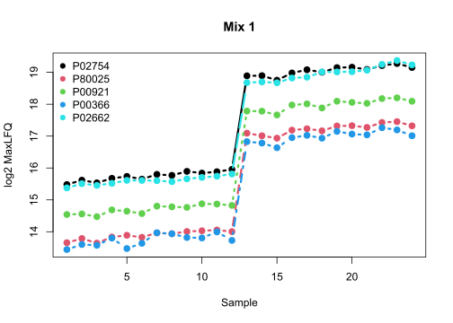
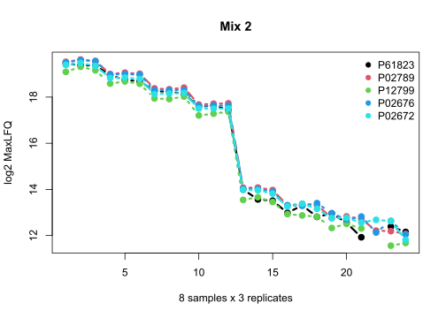
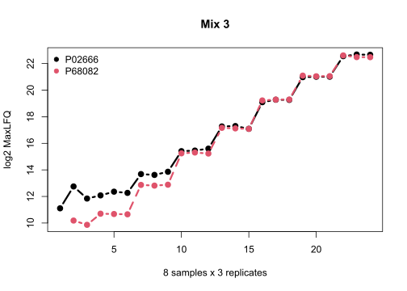
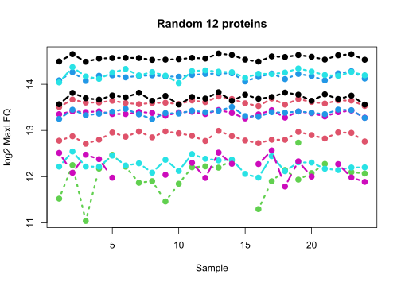

# iq: an R package  for protein quantification

This R package provides an implementation of the MaxLFQ algorithm by Cox et al. (2014) in a comprehensive pipeline for DIA-MS (Pham et al. 2020). It also offers options for protein quantification using the N most intense fragment ions, using all fragment ions, and the Tukey's median polish algorithm. In general, the tool can be used to integrate multiple proportional observations into a single quantitative value.

**Citation**

Pham TV, Henneman AA, Jimenez CR. iq: an R package to estimate relative protein abundances from ion quantification in DIA-MS-based proteomics, _Bioinformatics_ 2020 Apr 15;36(8):2611-2613.
[https://doi.org/10.1093/bioinformatics/btz961](https://doi.org/10.1093/bioinformatics/btz961)

## Installation

The package is hosted on CRAN. It is best to install from within R.

```
install.packages("iq")
```

## Usage

The package can be loaded in the usual manner

```
library("iq")
```

See [a recent example](https://cran.r-project.org/web/packages/iq/vignettes/iq-fast.html) for processing a Spectronaut output. 

Or [an older vignette](https://cran.r-project.org/web/packages/iq/vignettes/iq.html) for processing output from Spectronaut, OpenSWATH and MaxQuant with some visualization.

***To process a DIA-NN output***

```
process_long_format("report.tsv", 
                    output_filename = "report-pg-global.tsv", 
                    annotation_col = c("Protein.Names", "Genes"),
                    filter_double_less = c("Global.Q.Value" = "0.01", "Global.PG.Q.Value" = "0.01"))  
```

***To process a Spectronaut output***

Use this export schema [iq.rs](https://github.com/tvpham/iq/releases/download/v1.1/iq.rs) to make a long report, for example "Spectronaut_Report.xls".
```
process_long_format("Spectronaut_Report.xls",
                    output_filename = "iq-MaxLFQ.tsv", 
                    sample_id  = "R.FileName",
                    primary_id = "PG.ProteinGroups",
                    secondary_id = c("EG.Library", "FG.Id", "FG.Charge", "F.FrgIon", "F.Charge", "F.FrgLossType"),
                    intensity_col = "F.PeakArea",
                    annotation_col = c("PG.Genes", "PG.ProteinNames", "PG.FastaFiles"),
                    filter_string_equal = c("F.ExcludedFromQuantification" = "False"),
                    filter_double_less = c("PG.Qvalue" = "0.01", "EG.Qvalue" = "0.01"),
                    log2_intensity_cutoff = 0)
```

### Examples

<details>

<summary>Processing a DIA-NN output</summary>

#### Processing a DIA-NN output

We processed the Bruderer15 dataset (Bruderer et al., _MCP_ 2015) using [DIA-NN](https://github.com/vdemichev/DiaNN) 1.8.1 (Demichev et al., _Nature Methods_ 2020) with the switch `--report-lib-info` turned on. The switch gives an extra column `Fragment.Info` to test iq's new feature. Usually, the user does not need to turn it on.

Download [DIA-NN output report.zip](https://github.com/tvpham/iq/releases/download/v1.1/report.zip) and unzip the file to obtain the long format ouput `report.tsv`.

A protein group report for downstream analysis can be obtained with a single statement in R
```
library(iq)
process_long_format("report.tsv", output_filename = "report-pg.tsv")
```

As an aside, usually the user wants to include additional annotation columns in the final report. This is possible by specifying the `annotation_col` parameter.
```
process_long_format("report.tsv", output_filename = "report-pg-annotated.tsv",
                    annotation_col = c("Protein.Names", "Genes"))
```

Also, by default, we filter the report at 1% run-sepcific FDR at both precursor level and protein group level. To filter global FDR (available with a recent version of DIA-NN), use the parameter `filter_double_less`.
```
process_long_format("report.tsv", output_filename = "report-pg-global.tsv", 
                    annotation_col = c("Protein.Names", "Genes"),
                    filter_double_less = c("Global.Q.Value" = "0.01", "Global.PG.Q.Value" = "0.01"))  
```
  
We continue with loading the result file `report-pg.tsv` to check the quantitative values of the spike-in proteins. For convenience, we will use the spike-in protein names instead of the protein group names.

```
pg <- read.delim("report-pg.tsv")
rownames(pg) <- pg$Protein.Group

spike_ins <- c("P02754", "P80025", "P00921", "P00366", "P02662", # mix 1
               "P61823", "P02789", "P12799", "P02676", "P02672", # mix 2
               "P02666", "P68082")                               # mix 3

# change rownames to spike_ins names
for (i in 1: length(spike_ins)) {
    rownames(pg)[grep(spike_ins[i], rownames(pg))] <- spike_ins[i]
}
```

##### Mix 1

Here is the ground truth for proteins in Mix 1 (P02754, P80025, P00921, P00366, P02662). Each sample was measured in triplicate.
|Sample|relative|fmol/ul|
|------|--------|-------|
|1|1|1.5|
|2|1.1|1.65|
|3|1.21|1.815|
|4|1.33|1.995|
|5|10|15|
|6|11.01|16.515|
|7|12.11|18.165|
|8|13.33|19.995|


```
matplot(t(pg[spike_ins[1:5], 2:25]), type = 'b', col = 1:5 , pch=19, lwd = 3,
        ylab="log2 MaxLFQ", main = "Mix 1", xlab = "8 samples x 3 replicates")
legend("topleft", legend = spike_ins[1:5], col = 1:5, pch=19, bty = "n")
```


We see that the triplicates are consistent and the spikeins in first 4 samples (12 runs) are about 10 fold down as expected (log2(10) ~ 3.3).

##### Mix 2

Here is the ground truth of proteins in Mix 2 (P61823, P02789, P12799, P02676, P02672).
|Sample|relative|fmol/ul|
|------|--------|-------|
|1|200|100|
|2|125.99|62.995|
|3|79.37|39.685|
|4|50|25|
|5|4|2|
|6|2.52|1.26|
|7|1.59|0.795|
|8|1|0.5|


```
matplot(t(pg[spike_ins[6:10], 2:25]), type = 'b', col = 1:5 , pch=19, lwd = 3,
        ylab="log2 MaxLFQ", main = "Mix 2", xlab = "8 samples x 3 replicates")
legend("topright", legend = spike_ins[6:10], col = 1:5, pch=19, bty = "n")
```


In this mix, proteins in the first 4 samples are higher. Fold change between sample 1 and sample 5 is 50, which is approximately 5.6 in log2 space.

##### Mix 3
Here is the ground truth of proteins in Mix 3 (P02666, P68082).
|Sample|relative|fmol/ul|
|------|--------|-------|
|1|1|0.05|
|2|4|0.2|
|3|16|0.8|
|4|64|3.2|
|5|256|12.8|
|6|1024|51.2|
|7|4096|204.8|
|8|16384|819.2|
```

matplot(t(pg[spike_ins[11:12], 2:25]), type = 'b', col = 1:6 , pch=19, lwd = 3,
        ylab="log2 MaxLFQ", main = "Mix 3", xlab = "8 samples x 3 replicates")
legend("topleft", legend = spike_ins[11:12], col = 1:2, pch=19, bty = "n")
```


In this mix, the protein concentration increases 4 fold from sample 1 to sample 8. Thus, we expect a staircase shape with an increase of 2 in log2 space.

##### Random 12 proteins

```
set.seed(0)
matplot(t(pg[sample(1:nrow(pg), 12), 2:25]), type = 'b', col = 1:6 , pch=19, lwd = 3,
        ylab="log2 MaxLFQ", main = "Random 12 proteins", xlab = "8 samples x 3 replicates")
```


This is a set of 12 random proteins in the background. High abundance proteins show a consistent pattern while lower abundance proteins exhibits more variation and missing data, which is expected from mass spectrometry-based proteomics data.

</details>


<details>

<summary>Spectronaut output versus DIA-NN output</summary>

#### Spectronaut output versus DIA-NN output

The iq package has a dataset of 12 spikein protein from the Bruderer 15 dataset processed by the Spectronaut software. We will turn this dataset into something like DIA-NN output to better understand the parameters. The following will produce a file `spikeins-diann.tsv` in your workspace.

```
library(iq)

data("spikeins")
precursor <- paste(spikeins$EG.ModifiedSequence, spikeins$FG.Charge, sep = "_")

d <- NULL

for (p in unique(precursor)) {
    b <- spikeins[precursor == p,]
    for (s in unique(as.character(b$R.Condition))) {
        ss <- b[b$R.Condition == s,]
        d <- rbind(d, list(File.Name = s, 
                           Protein.Group = as.character(ss$PG.ProteinGroups[1]), 
                           Genes = as.character(ss$PG.Genes[1]), 
                           Precursor.Id = p, 
                           Fragment.Quant.Corrected = paste(ss$F.PeakArea, collapse = ";"), 
                           Fragment.Info = paste(paste(ss$F.FrgIon, ss$F.Charge, sep="_"), 
                                                 collapse = ";")))
    }
}

write.table(d, "spikeins-diann.tsv", sep = "\t", row.names = FALSE, quote = FALSE)
```

Examine the file `spikeins-diann.tsv` to see the difference with Spectronaut output, for example by typing `head(spikeins)` in your R console.

##### Standard iq processing
This is an example code in standard iq processing. The result `result$estimate` contains quantitative values of the 12 proteins. Note that the data has been normalized. So in the preprocessing, we set median normalization to `FALSE`.
```
norm_data <- preprocess(spikeins, median_normalization = FALSE, pdf_out = NULL)
protein_list <- create_protein_list(norm_data)
result <- create_protein_table(protein_list)
```

##### Process DIA-NN output using pure R 
The standard R processing for DIA-NN output is as follows. Because the default values were set to Spectronaut output, you will need to specify the columns values. Note that `intensity_col` and `intensity_col_id` contain `;` separated values.

```
raw <- read.delim("spikeins-diann.tsv")

norm_data2 <- preprocess(raw, 
                         sample_id  = "File.Name", 
                         primary_id = "Protein.Group",
                         secondary_id = "Precursor.Id",
                         intensity_col = "Fragment.Quant.Corrected",
                         median_normalization = FALSE,
                         intensity_col_sep = ";",
                         intensity_col_id = "Fragment.Info")

protein_list2 <- create_protein_list(norm_data2)
result2 <- create_protein_table(protein_list2)
```

The result of processing DIA-NN output should be equal to that of processing Spectronaut data (up to machine numerical accuracy).
```
max(result$estimate - result2$estimate)
min(result$estimate - result2$estimate)
identical(rownames(result$estimate), rownames(result2$estimate))
identical(colnames(result$estimate), colnames(result2$estimate))
```

You can plot a particular protein to see all its observed fragments.
```
plot_protein(protein_list2$P00366, main = "Protein P00366")
```


##### Fast processing

You can also use the fast implementation of MaxLFQ. Again, the parameters need to be specified because the data has been filtered and normalized.

```
iq_dat <- fast_read("spikeins-diann.tsv", 
                    sample_id  = "File.Name", 
                    primary_id = "Protein.Group",
                    secondary_id = "Precursor.Id",
                    intensity_col = "Fragment.Quant.Corrected",
                    intensity_col_sep = ";",
                    intensity_col_id = "Fragment.Info",
                    filter_string_equal  = NULL, 
                    filter_double_less = NULL,
                    annotation_col = NULL)

iq_norm_data <- fast_preprocess(iq_dat$quant_table,
                                median_normalization = FALSE)

result_fastest <- fast_MaxLFQ(iq_norm_data, 
                              row_names = iq_dat$protein[, 1], 
                              col_names = iq_dat$sample)

max(result$estimate - result_fastest$estimate)
min(result$estimate - result_fastest$estimate)
identical(rownames(result$estimate), rownames(result_fastest$estimate))
identical(colnames(result$estimate), colnames(result_fastest$estimate))
```

##### Oneliner

Finally, the data can be processed in one statement. Note that the parameter `normalization` is not a logical (`TRUE` or `FALSE`), but a string `"none"` or `"median"` (default). This is to support different normalization methods in the future.

```
process_long_format("spikeins-diann.tsv", output_filename = "spikeins-diann-out.tsv", 
                    filter_double_less = NULL, 
                    normalization = "none")
```

The output `spikeins-diann-out.tsv` should be equal to the existing R processing.

```
out <- read.delim("spikeins-diann-out.tsv")
rownames(out) <- out$Protein.Group
out <- out[rownames(result$estimate),]

max(result$estimate - out[, colnames(result$estimate)])
min(result$estimate - out[, colnames(result$estimate)])
```

</details>
